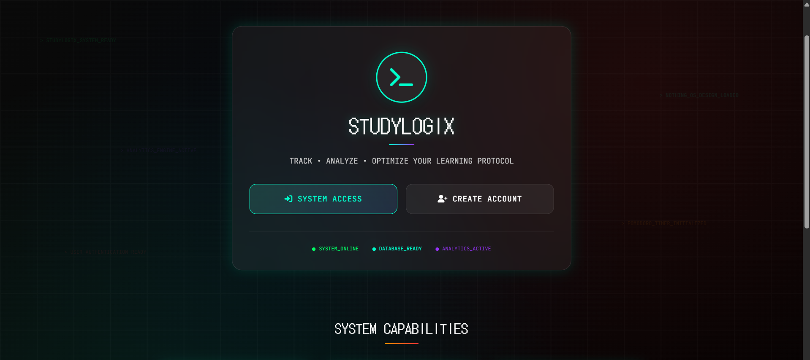
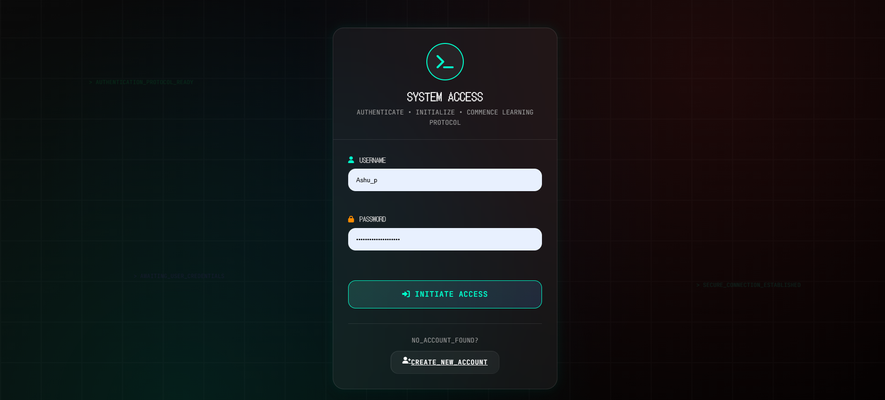
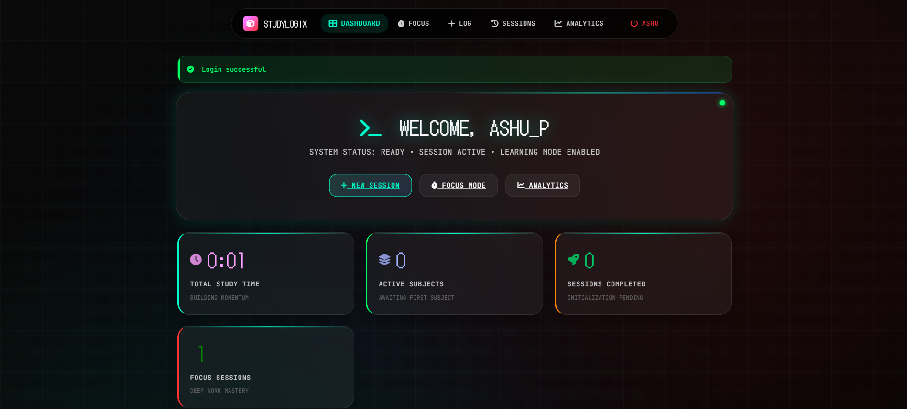
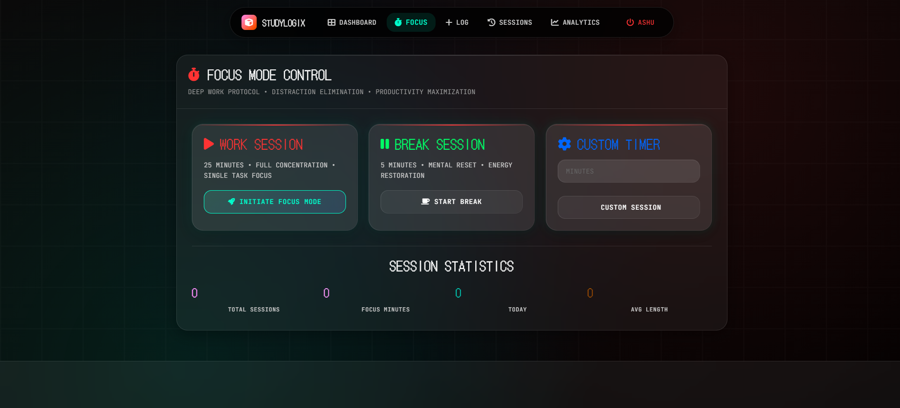

# StudyLogix - Nothing OS Design System


A comprehensive **Nothing OS-inspired** web application for tracking study sessions with advanced analytics, Pomodoro timer, and glassmorphism UI design.

## ✨ Features

### 🎯 Core Study Features
- **User Management**: Secure login/signup system with bcrypt password hashing
- **Study Session Logging**: Track subject, duration, mood, and productivity levels
- **Analytics Dashboard**: Comprehensive study time analysis and subject breakdowns
- **Goal Setting**: Set and track weekly study targets with visual progress indicators
- **Pomodoro Timer**: Built-in focus timer with floating orb interface

### 🎨 Nothing OS Design System
- **Glassmorphism UI**: Frosted glass effects and ambient backgrounds
- **DotGothic16 Typography**: Authentic Nothing OS font styling
- **Floating Navigation**: Seamless orbital navigation system
- **Ambient Animations**: Subtle floating elements and breathing effects
- **Terminal Aesthetics**: Monospace inputs with glow effects
- **Dark Theme**: Consistent Nothing OS black and white color palette

### 🚀 Technical Features
- **SQLite Database**: Zero-configuration local database (no server required)
- **Flask Web Framework**: Modern Python web application
- **Responsive Design**: Mobile-friendly interface
- **Real-time Updates**: Live session tracking and analytics
- **Data Persistence**: Automatic database initialization

## 📋 Requirements

- **Python 3.7+**
- **Modern Web Browser** (Chrome, Firefox, Safari, Edge)
- **No external database server required** (uses SQLite)

## 🛠️ Quick Installation

1. **Clone the repository:**
   ```bash
   git clone https://github.com/ashutoshpatraa/StudyLogix.git
   cd StudyLogix
   ```

2. **Install dependencies:**
   ```bash
   pip install flask bcrypt werkzeug
   ```

3. **Run the application:**
   ```bash
   python app.py
   ```

4. **Open in browser:**
   ```
   http://localhost:5000
   ```

That's it! The SQLite database will be created automatically on first run.

## � Screenshots

### 🏠 Landing Page

*Nothing OS-inspired landing page with glassmorphism effects and floating navigation*

### 🔐 Authentication

*Clean login interface with terminal-style inputs and ambient background*

### 📊 Dashboard

*Comprehensive dashboard showing study progress, analytics, and goal tracking*

### 🍅 Pomodoro Timer

*Floating orb Pomodoro timer with Nothing OS design aesthetics*

## �🗄️ Database Schema

StudyLogix uses SQLite with the following tables:

### 👤 Users Table
```sql
CREATE TABLE users (
    user_id INTEGER PRIMARY KEY AUTOINCREMENT,
    username TEXT UNIQUE NOT NULL,
    email TEXT UNIQUE NOT NULL,
    password_hash BLOB NOT NULL,
    created_at TIMESTAMP DEFAULT CURRENT_TIMESTAMP
);
```

### 📚 Study Sessions Table
```sql
CREATE TABLE study_sessions (
    session_id INTEGER PRIMARY KEY AUTOINCREMENT,
    user_id INTEGER NOT NULL,
    subject TEXT NOT NULL,
    duration_minutes INTEGER NOT NULL,
    mood TEXT CHECK(mood IN ('excellent', 'good', 'fair', 'poor')) NOT NULL,
    productivity TEXT CHECK(productivity IN ('very_high', 'high', 'medium', 'low', 'very_low')) NOT NULL,
    notes TEXT,
    session_date DATE NOT NULL,
    created_at TIMESTAMP DEFAULT CURRENT_TIMESTAMP,
    FOREIGN KEY (user_id) REFERENCES users(user_id) ON DELETE CASCADE
);
```

### 🎯 Study Goals Table
```sql
CREATE TABLE study_goals (
    goal_id INTEGER PRIMARY KEY AUTOINCREMENT,
    user_id INTEGER NOT NULL,
    subject TEXT NOT NULL,
    weekly_target_minutes INTEGER NOT NULL,
    week_start_date DATE NOT NULL,
    created_at TIMESTAMP DEFAULT CURRENT_TIMESTAMP,
    FOREIGN KEY (user_id) REFERENCES users(user_id) ON DELETE CASCADE,
    UNIQUE(user_id, subject, week_start_date)
);
```

### 🍅 Pomodoro Sessions Table
```sql
CREATE TABLE pomodoro_sessions (
    session_id INTEGER PRIMARY KEY AUTOINCREMENT,
    user_id INTEGER NOT NULL,
    subject TEXT NOT NULL,
    duration_minutes INTEGER DEFAULT 25,
    status TEXT CHECK(status IN ('active', 'completed', 'cancelled')) DEFAULT 'active',
    started_at TIMESTAMP DEFAULT CURRENT_TIMESTAMP,
    completed_at TIMESTAMP,
    created_at TIMESTAMP DEFAULT CURRENT_TIMESTAMP,
    FOREIGN KEY (user_id) REFERENCES users(user_id) ON DELETE CASCADE
);
```

## 🎮 Usage Guide

### 🚀 Getting Started
1. **Launch the app**: Run `python app.py` and visit `http://localhost:5000`
2. **Create Account**: Register with username, email, and password
3. **Login**: Access your personalized dashboard
4. **Start Studying**: Use the Pomodoro timer or log manual sessions

### 📊 Dashboard Features
- **Today's Progress**: Real-time study time tracking
- **Subject Breakdown**: Visual analysis of study distribution
- **Goal Progress**: Weekly target tracking with progress bars
- **Recent Sessions**: Quick overview of latest study activities

### 🍅 Pomodoro Timer
- **25-minute Focus Sessions**: Classic Pomodoro technique
- **Floating Orb Interface**: Nothing OS-inspired timer design
- **Subject Tracking**: Link sessions to specific subjects
- **Break Reminders**: Automatic break suggestions

### 📈 Analytics
- **Total Study Time**: Lifetime and weekly summaries
- **Subject Analysis**: Time distribution across subjects
- **Productivity Trends**: Mood and productivity tracking
- **Goal Achievement**: Weekly target progress monitoring

## 📁 File Structure

```
StudyLogix/
├── app.py                    # Main Flask application
├── database.py               # SQLite database management
├── managers.py               # User, Session, and Goal managers
├── pomodoro_manager.py       # Pomodoro timer logic
├── analytics.py              # Data analysis and insights
├── requirements.txt          # Python dependencies
├── study_tracker.db          # SQLite database (auto-created)
├── static/
│   ├── css/
│   │   └── nothing-os.css    # Nothing OS design system
│   └── js/
│       ├── dashboard.js      # Dashboard functionality
│       ├── pomodoro.js       # Timer functionality
│       └── analytics.js      # Charts and analytics
└── templates/
    ├── base.html             # Base template
    ├── index.html            # Landing page
    ├── login.html            # User authentication
    ├── register.html         # User registration
    ├── dashboard.html        # Main dashboard
    ├── pomodoro.html         # Pomodoro timer
    ├── sessions.html         # Session history
    ├── log_session.html      # Manual session logging
    └── analytics.html        # Analytics and insights
```

## 🎨 Nothing OS Design Elements

### 🌌 Visual Design
- **Glassmorphism**: Frosted glass cards with backdrop blur
- **Ambient Backgrounds**: Subtle gradient animations
- **Floating Elements**: Orbital navigation and breathing effects
- **Typography**: DotGothic16 font for authentic Nothing OS feel

### 🎭 Interactive Elements
- **Hover Effects**: Smooth transitions and glow effects
- **Focus States**: Terminal-style input highlighting
- **Button Animations**: Scale and glow transformations
- **Loading States**: Elegant progress indicators

### 📱 Responsive Design
- **Mobile-First**: Optimized for all screen sizes
- **Touch-Friendly**: Large tap targets and gestures
- **Performance**: Lightweight CSS animations
- **Accessibility**: High contrast and keyboard navigation

## 🔧 Configuration

### Environment Variables (Optional)
```bash
# Database configuration
FLASK_ENV=development
FLASK_DEBUG=True

# Security
SECRET_KEY=your-secret-key-here
```

### Customization
- **Timer Duration**: Modify Pomodoro duration in `pomodoro_manager.py`
- **UI Colors**: Update CSS variables in `nothing-os.css`
- **Database**: Extend schema in `database.py`

## 🚀 Deployment

### Local Development
```bash
python app.py
```

### Production (Example with Waitress)
```bash
pip install waitress
waitress-serve --host=0.0.0.0 --port=8080 app:app
```

### Docker (Optional)
```dockerfile
FROM python:3.9-slim
WORKDIR /app
COPY requirements.txt .
RUN pip install -r requirements.txt
COPY . .
EXPOSE 5000
CMD ["python", "app.py"]
```

## 🤝 Contributing

We welcome contributions! Here's how to get started:

1. **Fork the repository**
2. **Create a feature branch**: `git checkout -b feature/amazing-feature`
3. **Commit changes**: `git commit -m 'Add amazing feature'`
4. **Push to branch**: `git push origin feature/amazing-feature`
5. **Open a Pull Request**

### 🐛 Bug Reports
- Use GitHub Issues
- Include steps to reproduce
- Provide system information

### 💡 Feature Requests
- Describe the use case
- Explain the expected behavior
- Consider Nothing OS design principles

## 📄 License

This project is licensed under the MIT License - see the [LICENSE](LICENSE) file for details.

## 🙏 Acknowledgments

- **Nothing OS**: Design inspiration and aesthetic guidelines
- **Flask Community**: Web framework and documentation
- **Material Design**: UI/UX principles and patterns
- **Open Source**: All the amazing libraries that make this possible

## 📞 Support

- **GitHub Issues**: [Report bugs and request features](https://github.com/ashutoshpatraa/StudyLogix/issues)
- **Documentation**: Check the code comments and docstrings
- **Community**: Share your experience and help others

---

<div align="center">

**StudyLogix Made with ❤️ By Ashu**

[⭐ Star this repo](https://github.com/ashutoshpatraa/StudyLogix) • [🐛 Report Bug](https://github.com/ashutoshpatraa/StudyLogix/issues) • [✨ Request Feature](https://github.com/ashutoshpatraa/StudyLogix/issues)

</div>
