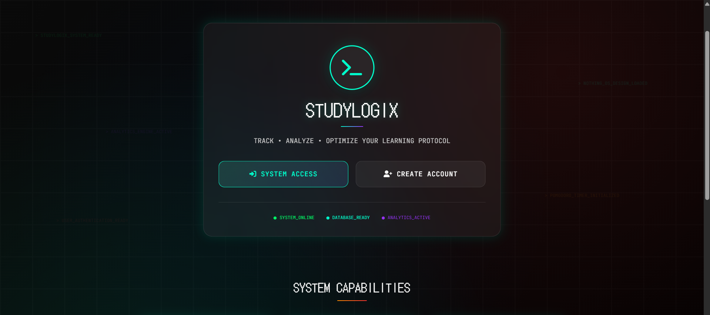
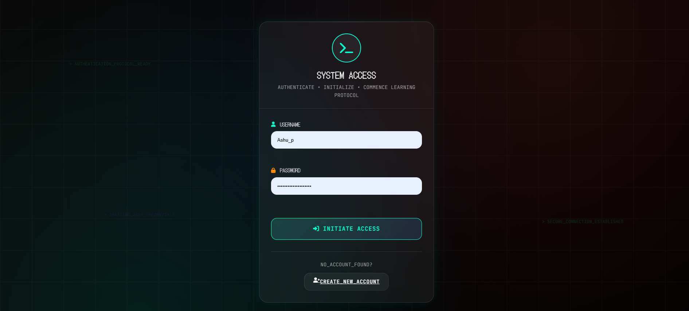
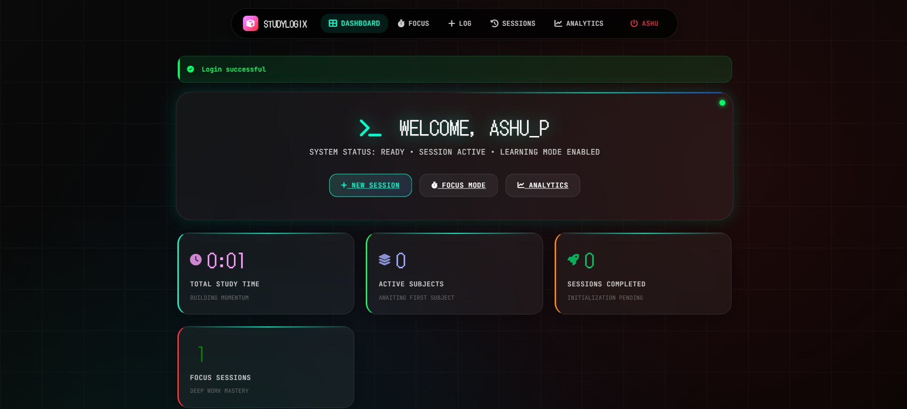
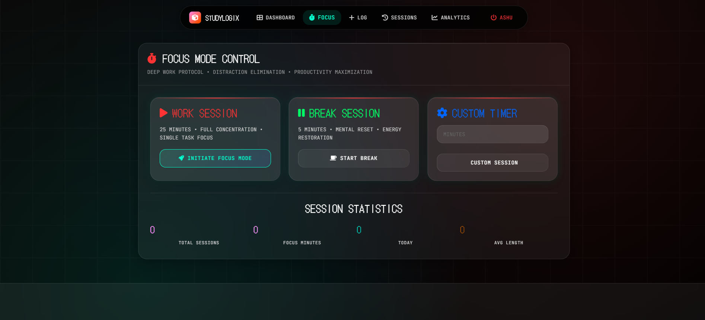

<div align="center">

# 📚 StudyLogix

**Track • Analyse • Optimise Your Learning**

[](https://www.python.org/)
[](https://flask.palletsprojects.com/)
[](https://www.sqlite.org/)
[](LICENSE)
[](CONTRIBUTING.md)

A beautifully designed, **Nothing OS-inspired** web application for tracking study sessions, managing Pomodoro focus timers, viewing analytics, and studying with friends — all wrapped in a glassmorphism UI with ambient animations.

[Getting Started](#-quick-start) · [Screenshots](#-screenshots) · [Deploy on Render](#-deploy-to-rendercom) · [Contributing](#-contributing)

</div>

---

## ✨ Key Features

| Feature | Description |
|---------|-------------|
| 🔐 **Secure Auth** | User registration & login with **bcrypt** password hashing, session security, and HTTP security headers |
| 📝 **Session Logging** | Record subject, duration, mood, and productivity for every study session |
| 🍅 **Pomodoro Timer** | Immersive floating-orb focus timer with work/break cycles and live notifications |
| 📊 **Analytics Dashboard** | Interactive Chart.js graphs showing daily trends, subject breakdowns, and productivity patterns |
| 👥 **Friends & Live Timers** | Add friends, track weekly progress, and see who is studying right now |
| 🎯 **Goal Tracking** | Set weekly study targets and monitor progress with visual indicators |
| 🌗 **Dark / Light Theme** | Toggle between themes with `Alt + T` — preference saved locally |
| 📱 **Responsive Design** | Mobile-first layout that works on phones, tablets, and desktops |

---

## 📸 Screenshots

| Landing Page | Login |
|:---:|:---:|
|  |  |

| Dashboard | Pomodoro Timer |
|:---:|:---:|
|  |  |

---

## 🛠️ Tech Stack

| Layer | Technology |
|-------|-----------|
| **Backend** | Python · Flask · Gunicorn |
| **Database** | SQLite (zero-config, file-based) |
| **Auth** | bcrypt password hashing |
| **Frontend** | Jinja2 templates · Bootstrap 5 · Chart.js · Font Awesome |
| **Design** | Nothing OS glassmorphism · DotGothic16 / JetBrains Mono fonts |
| **Deployment** | Render.com · Docker (optional) |

---

## 🚀 Quick Start

### Prerequisites

- **Python 3.8+** — [Download](https://www.python.org/downloads/)
- **pip** (comes with Python)
- A modern browser (Chrome, Firefox, Safari, Edge)

### 1. Clone the repository

```bash
git clone https://github.com/ashutoshpatraa/StudyLogix.git
cd StudyLogix
```

### 2. Create a virtual environment (recommended)

```bash
python -m venv .venv
source .venv/bin/activate      # macOS / Linux
# .venv\Scripts\activate       # Windows
```

### 3. Install dependencies

```bash
pip install -r requirements.txt
```

### 4. Configure environment variables

```bash
cp .env.example .env
# Edit .env and set a strong SECRET_KEY
```

| Variable | Required | Default | Description |
|----------|----------|---------|-------------|
| `SECRET_KEY` | **Yes** (production) | Random bytes | Signs session cookies. Generate with `python -c "import secrets; print(secrets.token_hex(32))"` |
| `FLASK_ENV` | No | `development` | Set to `production` for secure cookies and no debug mode |
| `PORT` | No | `5000` | Port the server listens on |

### 5. Run the application

```bash
python app.py
```

### 6. Open in your browser

```
http://localhost:5000
```

> The SQLite database (`study_tracker.db`) is created automatically on first run. No external database server required!

---

## 🌐 Deploy to Render.com

StudyLogix includes a [`render.yaml`](render.yaml) blueprint for **one-click deployment** on [Render](https://render.com/).

### Option A — Blueprint Deploy (Fastest)

1. Push your repo to GitHub (or fork [this repo](https://github.com/ashutoshpatraa/StudyLogix)).
2. Go to [Render Dashboard → **New** → **Blueprint**](https://dashboard.render.com/select-repo?type=blueprint).
3. Connect your GitHub account and select the **StudyLogix** repo.
4. Render reads `render.yaml` and auto-configures everything — just click **Apply**.
5. Wait for the build to complete. Your app will be live at `https://studylogix.onrender.com` (or your custom subdomain).

### Option B — Manual Setup

1. Go to [Render Dashboard → **New** → **Web Service**](https://dashboard.render.com/).
2. Connect your GitHub repo.
3. Configure the service:

| Setting | Value |
|---------|-------|
| **Environment** | Python 3 |
| **Build Command** | `pip install -r requirements.txt` |
| **Start Command** | `gunicorn app:app` |
| **Plan** | Free (or higher) |

4. Add **environment variables** in the Render dashboard:

| Key | Value |
|-----|-------|
| `SECRET_KEY` | *(click "Generate" for a secure random value)* |
| `FLASK_ENV` | `production` |
| `PYTHON_VERSION` | `3.12` |

5. Add a **Persistent Disk** (required for SQLite data to survive redeploys):

| Setting | Value |
|---------|-------|
| **Name** | `studylogix-data` |
| **Mount Path** | `/opt/render/project/src` |
| **Size** | 1 GB |

6. Click **Create Web Service** and wait for the deploy.

> **Important**: Without a persistent disk, your SQLite database will be wiped on every deploy. Always attach a disk in production.

---

## 🐳 Docker (Alternative)

```dockerfile
FROM python:3.12-slim
WORKDIR /app
COPY requirements.txt .
RUN pip install --no-cache-dir -r requirements.txt
COPY . .
EXPOSE 5000
CMD ["gunicorn", "--bind", "0.0.0.0:5000", "app:app"]
```

```bash
docker build -t studylogix .
docker run -p 5000:5000 -e SECRET_KEY=$(python -c "import secrets;print(secrets.token_hex(32))") studylogix
```

---

## 🔒 Security Practices

StudyLogix follows these security measures:

- **Passwords** are hashed with **bcrypt** (never stored in plaintext).
- **Session cookies** are `HttpOnly`, `SameSite=Lax`, and `Secure` in production.
- **Secret key** is loaded from the `SECRET_KEY` environment variable.
- **Security HTTP headers** are set on every response:
  - `X-Content-Type-Options: nosniff`
  - `X-Frame-Options: DENY`
  - `Content-Security-Policy` (script/style/font allowlists)
  - `Referrer-Policy: strict-origin-when-cross-origin`
- **Input validation** on all user-submitted fields (username, password, subjects, durations).
- **IDOR protection** — Pomodoro session ownership is verified before completion or cancellation.
- **No sensitive data in logs** — database errors are logged internally; users see generic messages.
- **XSS prevention** — DOM manipulation uses `textContent` / `createElement` instead of `innerHTML`.

> **Recommendation for production**: Use HTTPS (Render provides this automatically), rotate `SECRET_KEY` periodically, and consider a proper database (PostgreSQL) for multi-instance deployments.

---

## 📁 Project Structure

```
StudyLogix/
├── app.py                    # Main Flask application & routes
├── database.py               # SQLite database manager & password hashing
├── pomodoro_manager.py       # Pomodoro timer session logic
├── friend_manager.py         # Friend requests, progress, & live timers
├── managers.py               # CLI managers (UserManager, GoalManager)
├── analytics.py              # CLI chart generation & CSV export
├── requirements.txt          # Pinned Python dependencies
├── render.yaml               # Render.com deployment blueprint
├── .env.example              # Environment variable template
├── .gitignore                # Git ignore rules
├── photos/                   # Screenshot images for README
│   ├── index.png
│   ├── login.png
│   ├── dashboard.png
│   └── timer.png
├── static/
│   └── css/
│       └── style.css         # Nothing OS design system
└── templates/
    ├── base.html             # Base layout with navbar & theme toggle
    ├── index.html            # Landing page
    ├── login.html            # Login form
    ├── register.html         # Registration form
    ├── dashboard.html        # Main dashboard with stats
    ├── pomodoro.html         # Floating orb Pomodoro timer
    ├── log_session.html      # Manual session logging form
    ├── sessions.html         # Session history archive
    ├── analytics.html        # Analytics with Chart.js
    └── friends.html          # Friends list & live timers
```

---

## 🤝 Contributing

Contributions are welcome! Follow these steps:

1. **Fork** the repository.
2. **Create a branch**: `git checkout -b feature/my-feature`
3. **Commit** your changes: `git commit -m 'Add my feature'`
4. **Push**: `git push origin feature/my-feature`
5. **Open a Pull Request** on GitHub.

### Guidelines

- Follow existing code style and naming conventions.
- Add or update docstrings for new functions.
- Keep security in mind — validate inputs, avoid `innerHTML`, never commit secrets.
- Test your changes locally before submitting.

### Reporting Issues

- Use [GitHub Issues](https://github.com/ashutoshpatraa/StudyLogix/issues) to report bugs or request features.
- Include steps to reproduce, expected vs. actual behaviour, and your Python/OS version.

---

## 📄 License

This project is licensed under the **MIT License** — see the [LICENSE](LICENSE) file for details.

---

## 🗺️ Roadmap / Future Improvements

- [ ] PostgreSQL support for multi-instance production deployments
- [ ] OAuth login (Google, GitHub)
- [ ] Export study data as CSV / PDF reports
- [ ] Study group chat and shared goals
- [ ] Spaced repetition flashcard integration
- [ ] Progressive Web App (PWA) with offline support
- [ ] REST API documentation (OpenAPI / Swagger)
- [ ] Automated test suite (pytest)
- [ ] Rate limiting on authentication endpoints
- [ ] Email notifications for goal milestones

---

## 🙏 Acknowledgements

- **[Nothing OS](https://nothing.tech/)** — Design inspiration and aesthetic guidelines
- **[Flask](https://flask.palletsprojects.com/)** — Lightweight Python web framework
- **[Chart.js](https://www.chartjs.org/)** — Beautiful client-side charts
- **[Bootstrap](https://getbootstrap.com/)** — Responsive CSS framework
- **[Font Awesome](https://fontawesome.com/)** — Icon library
- All the amazing **open-source libraries** that power this project

---

<div align="center">

**Made with ❤️ by [Ashu](https://github.com/ashutoshpatraa)**

[⭐ Star this repo](https://github.com/ashutoshpatraa/StudyLogix) · [🐛 Report Bug](https://github.com/ashutoshpatraa/StudyLogix/issues) · [✨ Request Feature](https://github.com/ashutoshpatraa/StudyLogix/issues)

</div>
